# Are You Okay?

Written by Ellen S. Mulkerin  
Illustrated by Garth Bruner 

# Are You Okay?

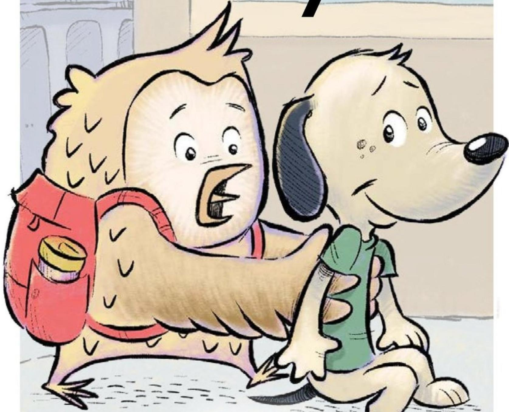

Written by 

Ellen S. Mulkerin 

Illustrated by Garth Bruner 

# Focus Question

What can happen if you help others? 

# Words to Know

fell 

help 

hook 

hung 

okay 

recess 

Are You Okay? 

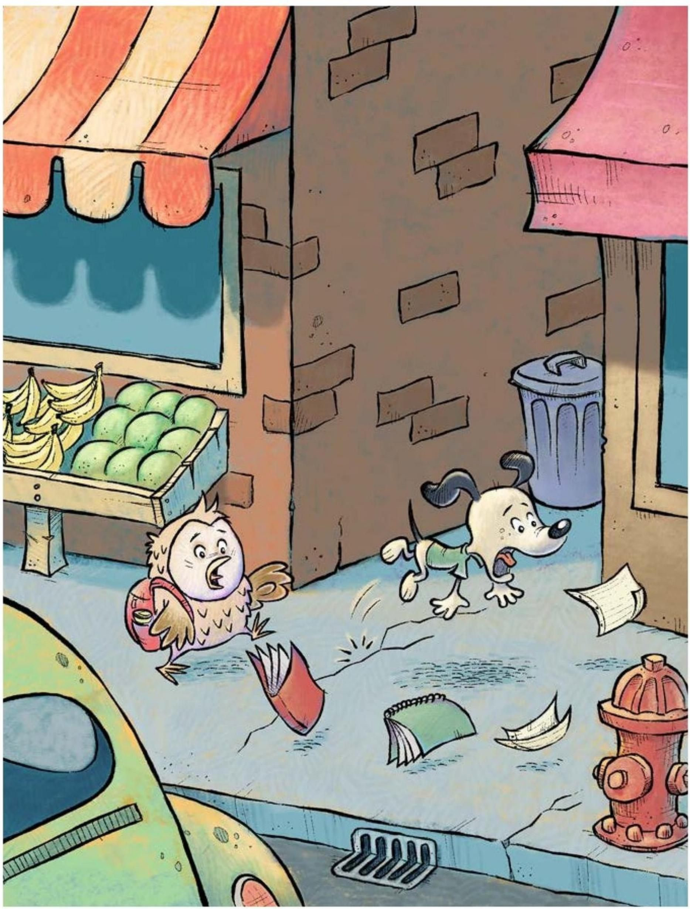

Owl and Dog were walking to school. Dog tripped and fell. 

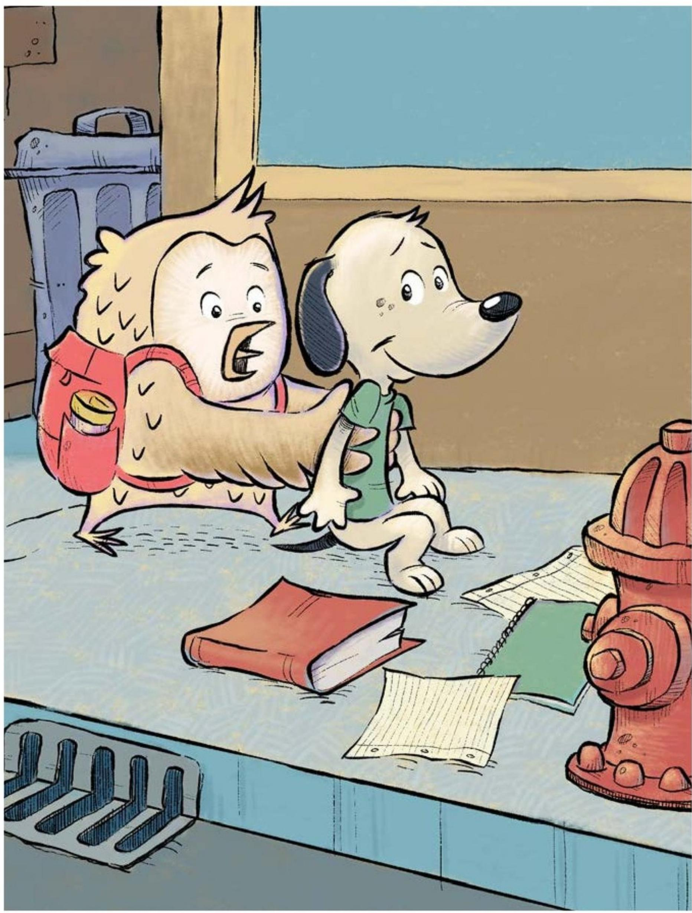

"Are you okay?" asked Owl. 

"Yes, I'm okay," said Dog. 

Owl helped Dog up. 

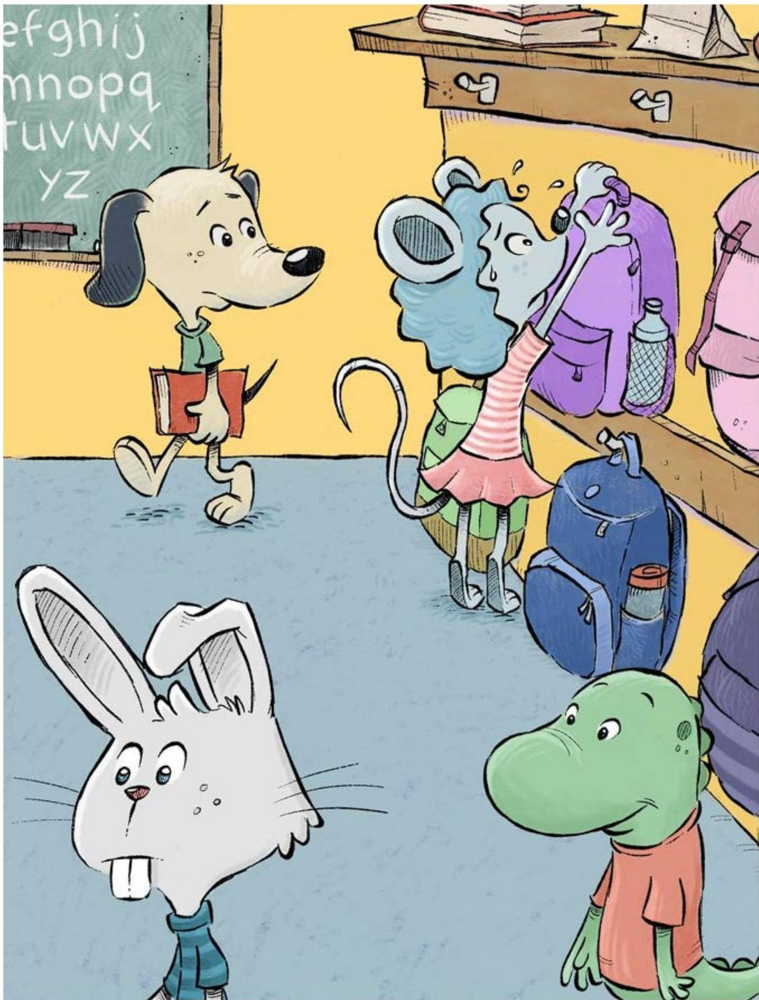

Mouse was hanging up 

her backpack. 

She couldn’t reach the hook. 

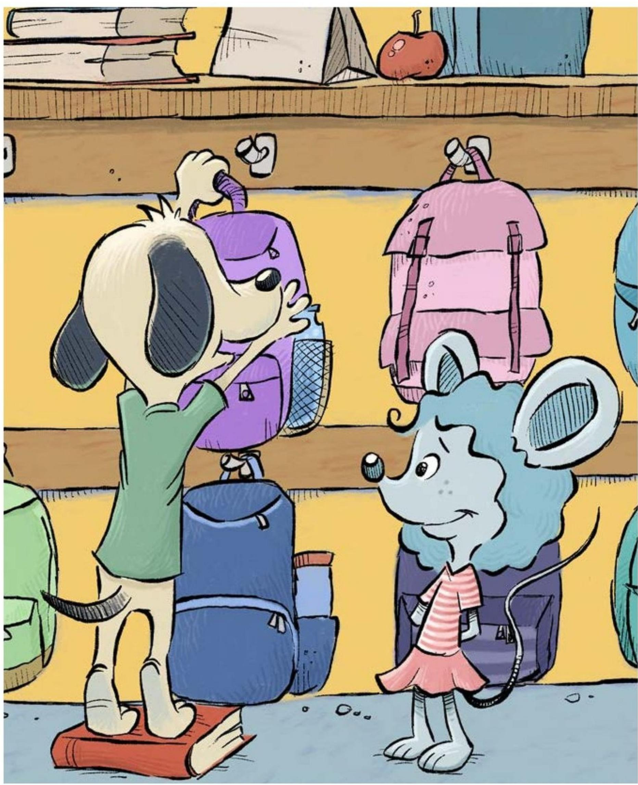

"Can I help?" asked Dog. 

"Yes, you can help," said Mouse. Dog hung up Mouse's backpack. 

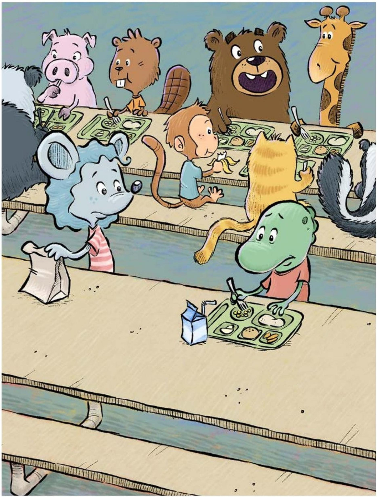

Mouse sat down next to Lizard at lunch. Lizard looked sad. 

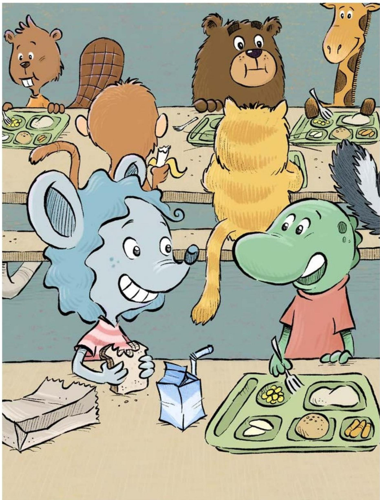

"Are you okay?" asked Mouse. 

"Yes, I am okay," said Lizard. 

Lizard smiled at his new friend. 

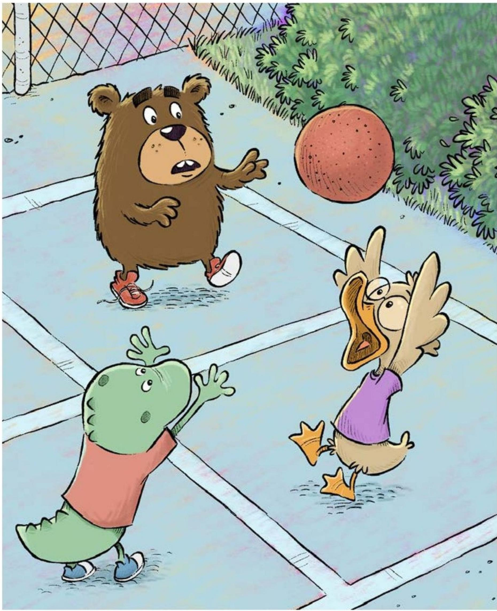

Lizard was playing ball with Duck at recess. 

Duck missed the ball and couldn't find it. 

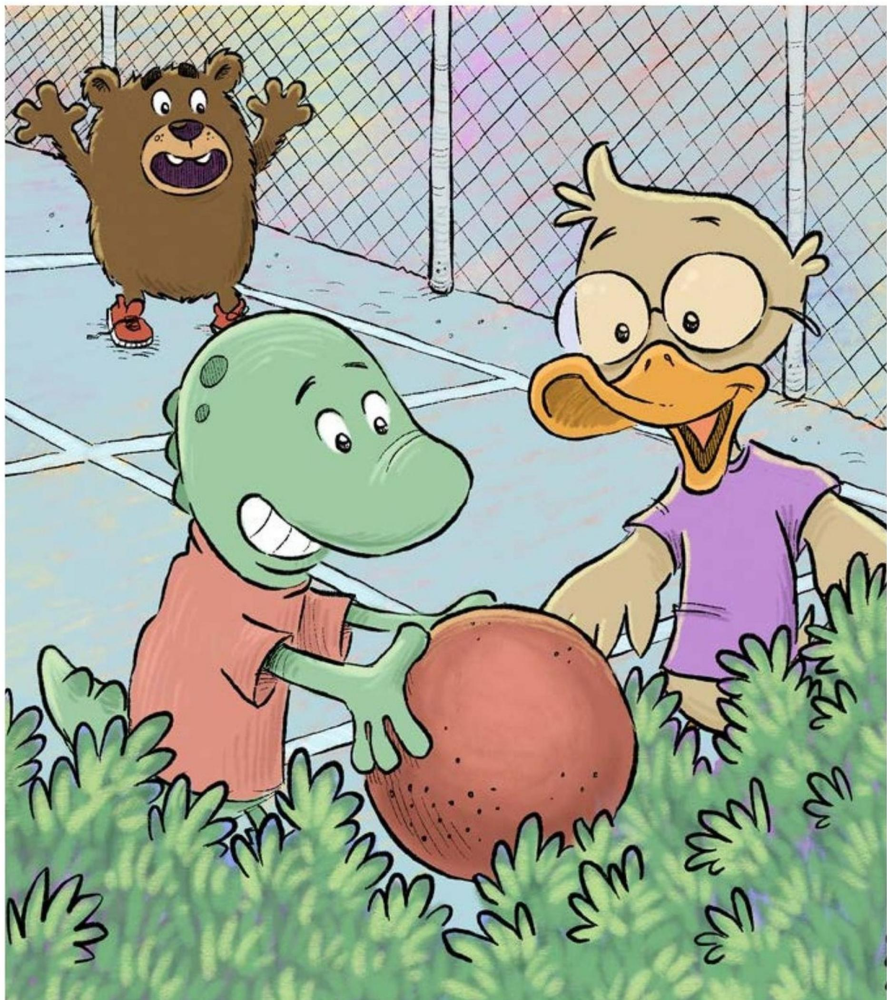

"Do you want some help?" asked Lizard. 

"Yes, I'd like some help!" said Duck. 

Lizard and Duck found the ball. 

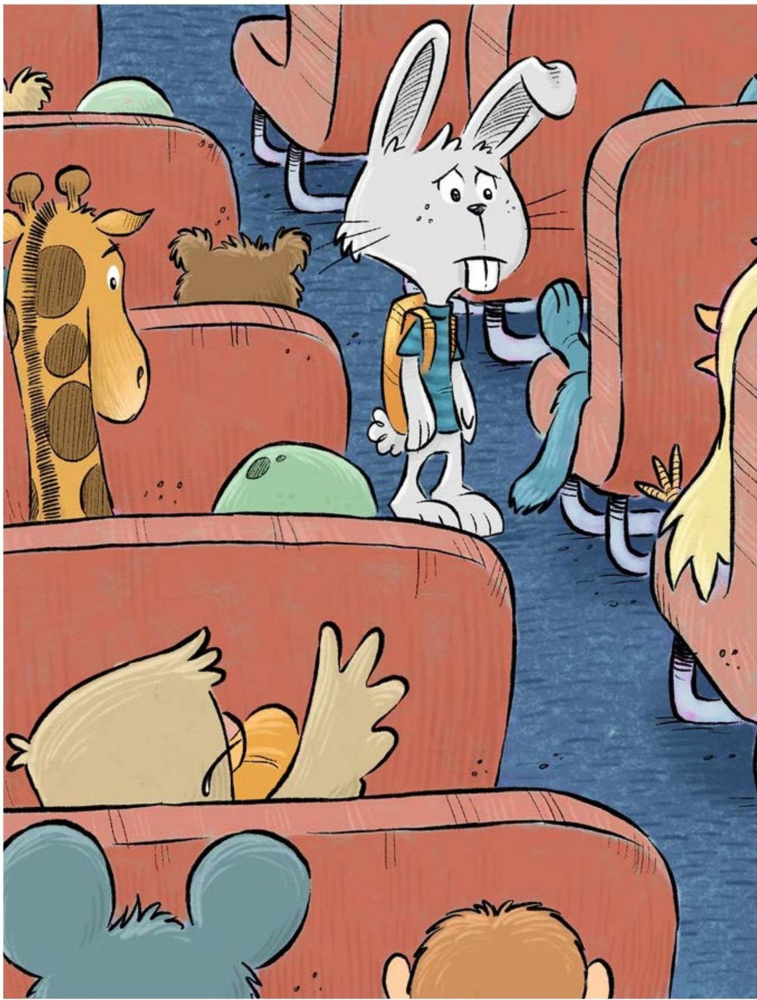

Rabbit got on the school 

bus home. 

He saw no friends to sit with. 

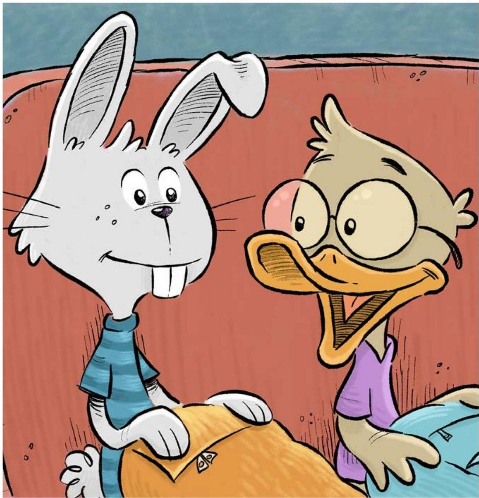

"Would you like to sit with me?" 

Duck asked. 

"Yes, I'd like to sit with you," 

said Rabbit. 

"Are you okay?" asked Duck. 

"Now I am!" said Rabbit. 

# Are You Okay?

A Reading A-Z Level F Leveled Book
Word Count: 158 

# Connections

# Writing and Art

When have you helped someone? 

Draw a picture. 

Write how it made you feel. 

# Social Studies

Why is it important to help 

others in your community? 

Share your ideas with a partner. 