# At the Airport

Written by Anthony Curran 

# At the Airport

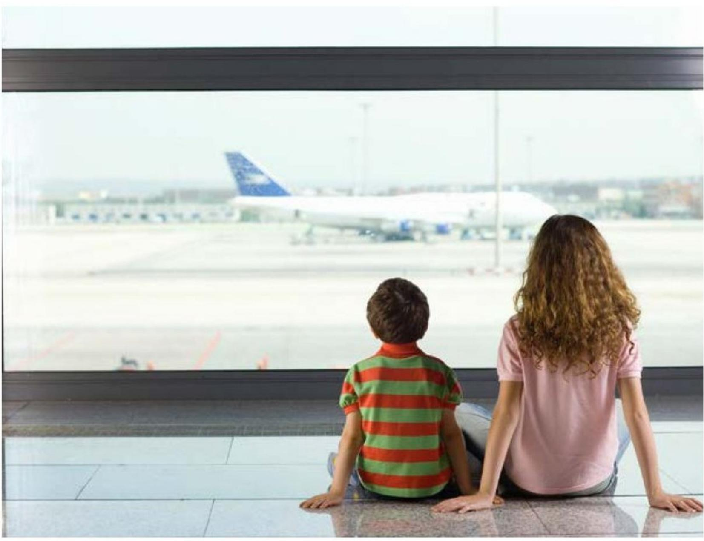

Written by Anthony Curran 

# Focus Question

What do people do at the airport? 

# Words to Know

airline 

airport 

check in 

planes 

searched 

travelers 

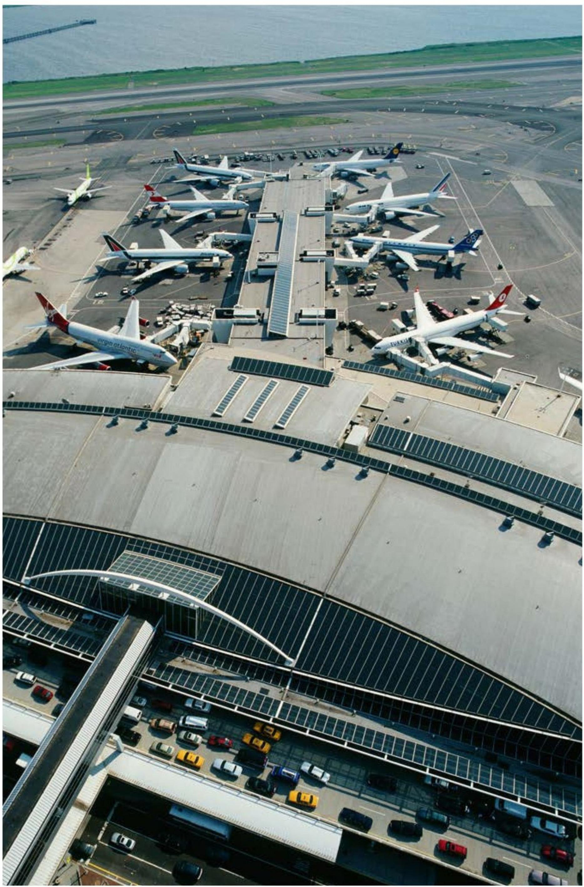

# What happens at the airport?

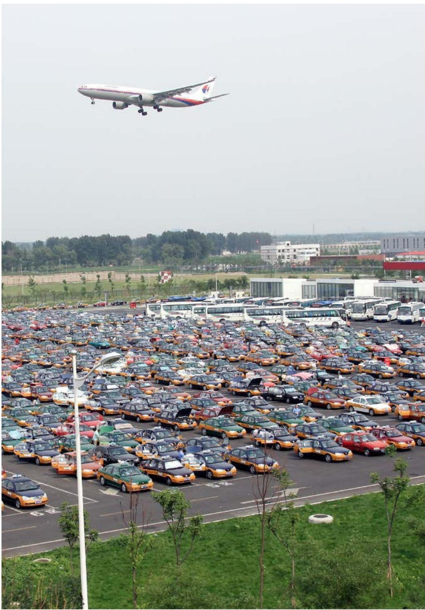

Travelers park their cars in big parking lots at the airport. 

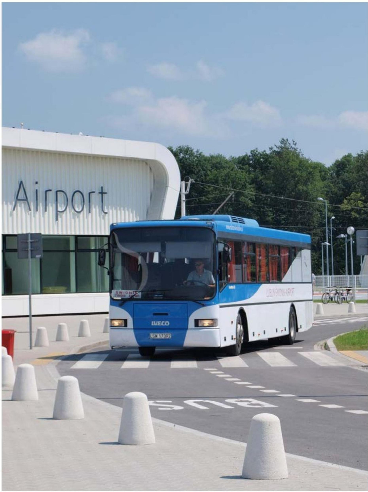

Travelers take buses to go to the main building at the airport. 

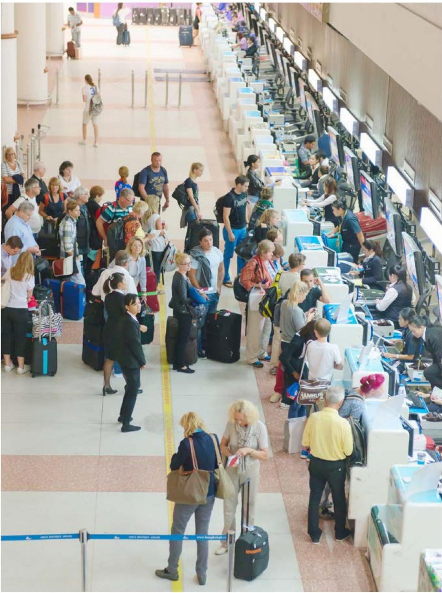

Travelers stand in line to check in with their airline at the airport. 

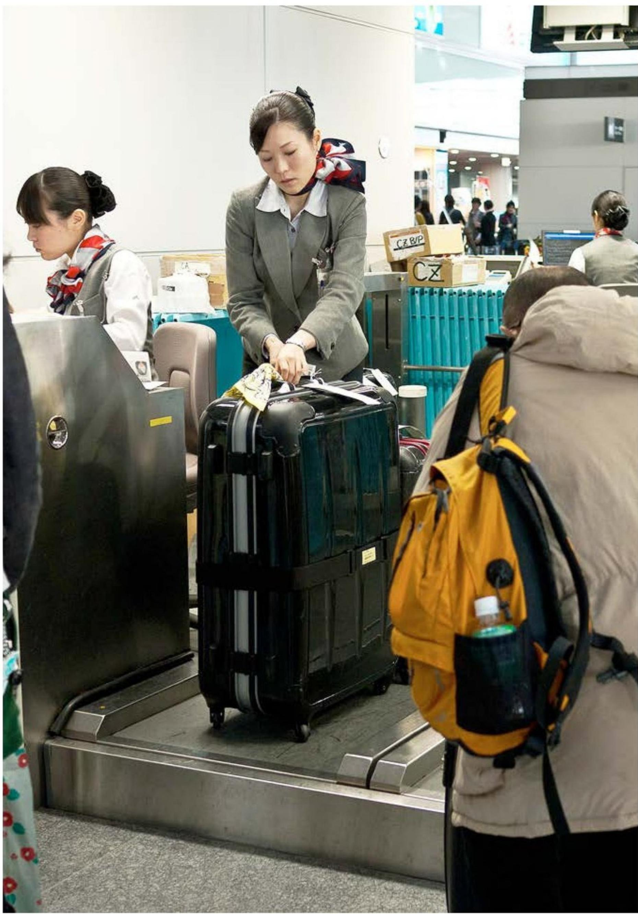

# Travelers hand over their large bags at the airport.

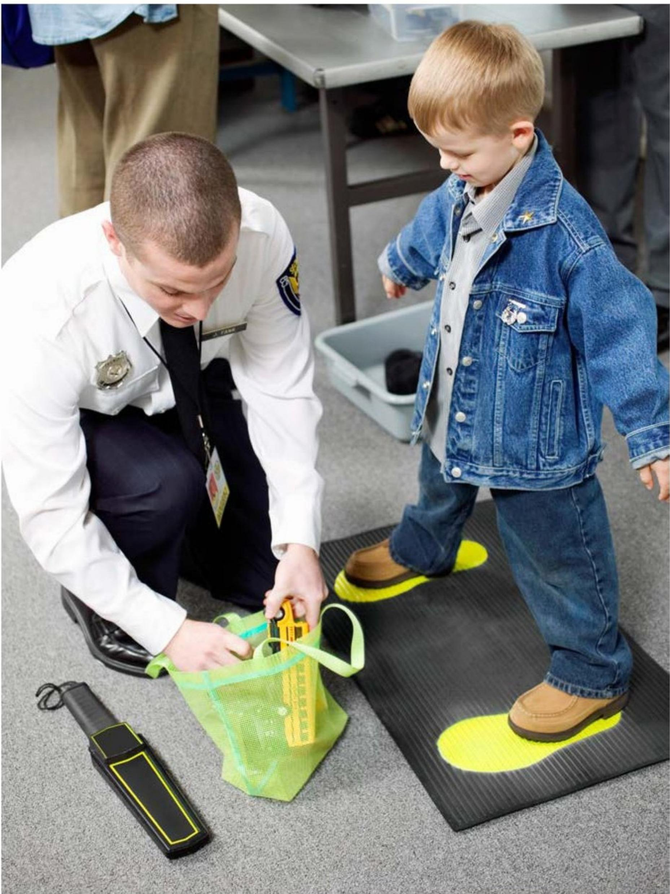

Travelers are searched to keep everyone safe at the airport. 

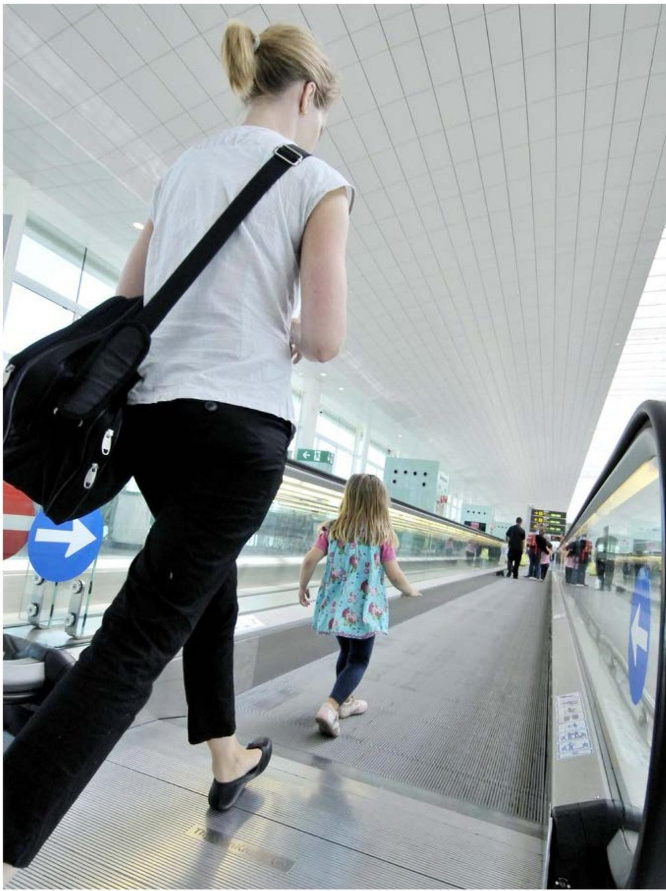

Travelers ride on moving sidewalks to get around faster at the airport. 

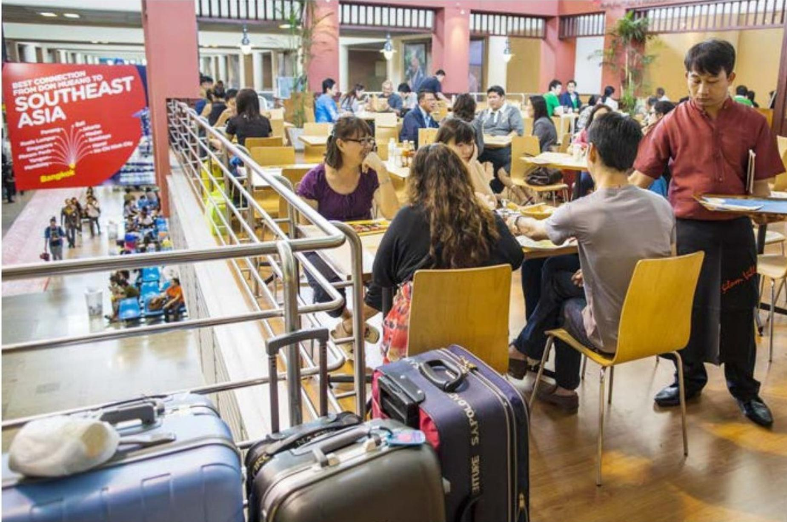

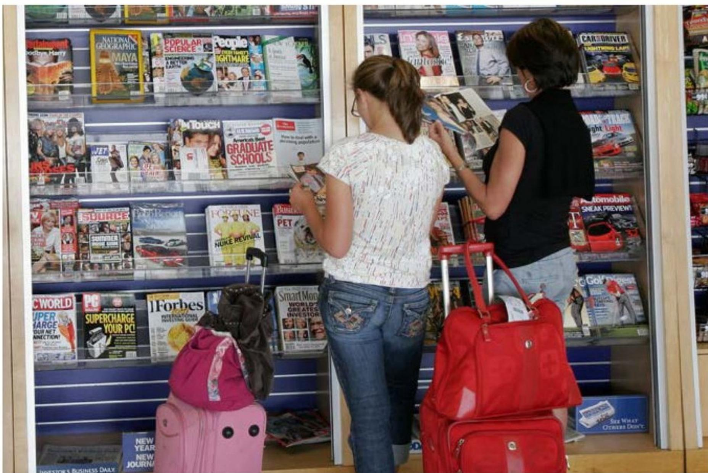

Travelers buy food and magazines before their flights at the airport. 

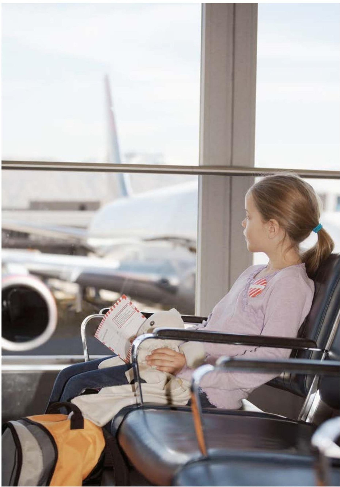

Travelers wait to get on their planes at the airport. 

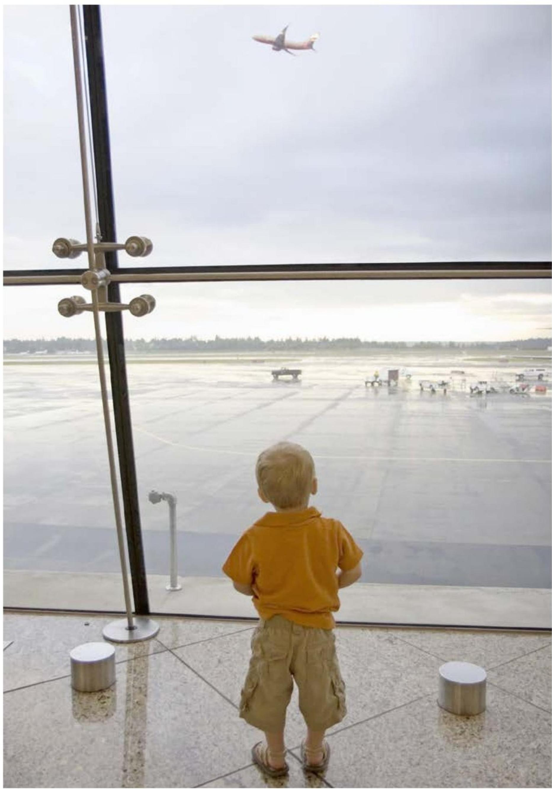

Travelers get on their planes and fly away at the airport. 

# At the Airport

A Reading A-Z Level F Leveled Book 

Word Count: 104 

# Connections

# Writing

If you could fly anywhere in the world, where would you go and why? Write about it. 

# Social Studies

On a map of your country, mark where you live and one place you would like to visit. Share your map with a partner. 