# At the MOVIES

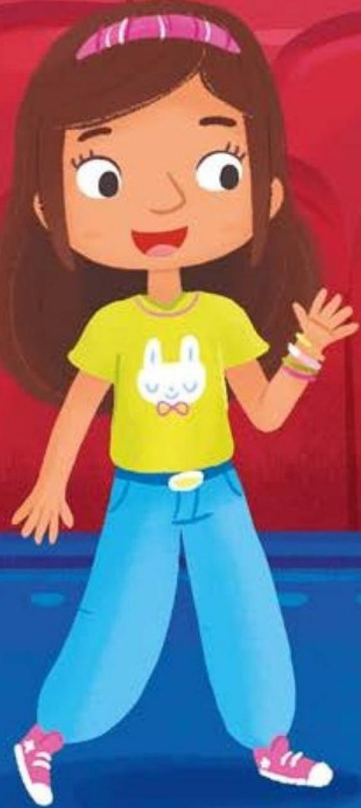

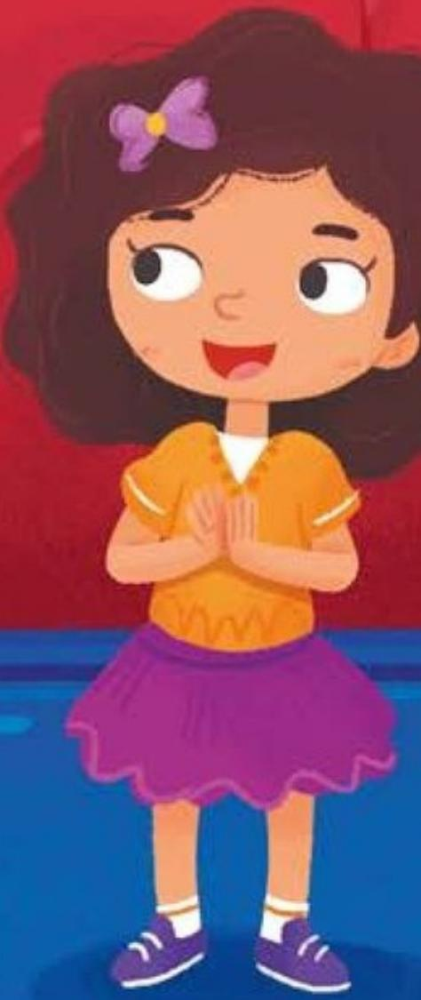

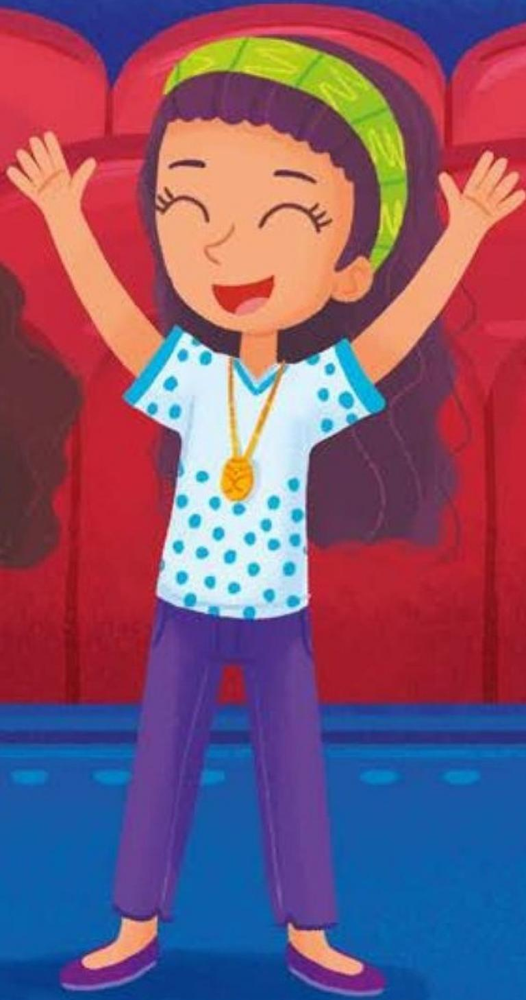

Written by Racheal Rice • Illustrated by Gabriele Tafuni 

# At the Movies

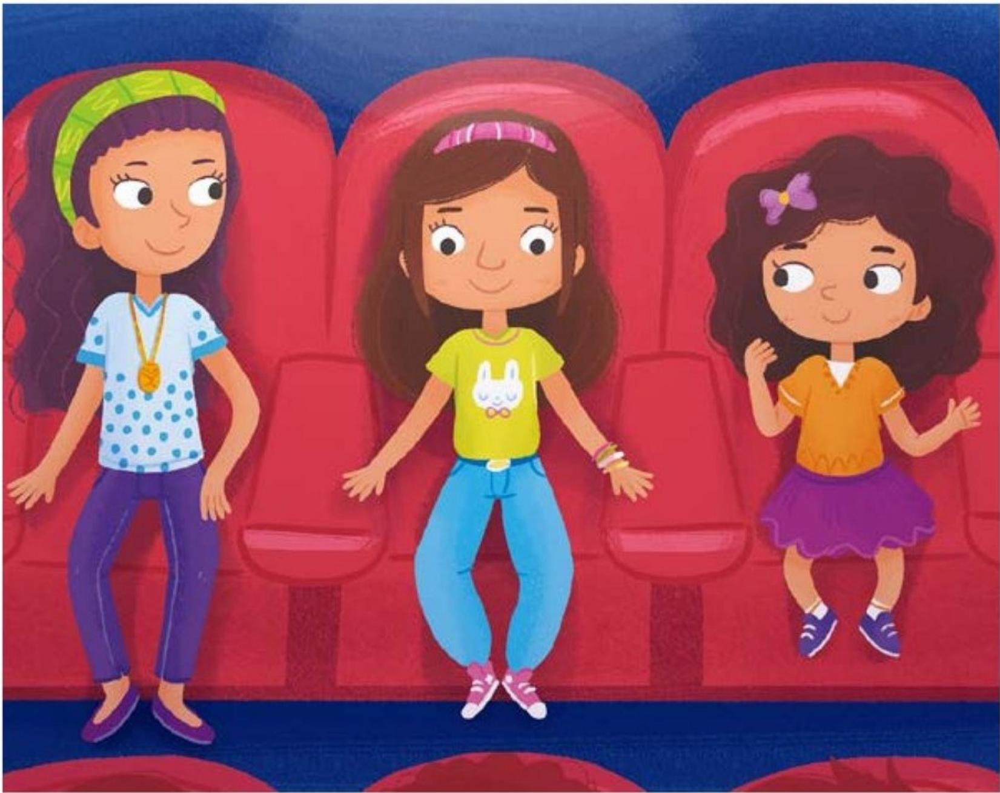

# Focus Question

How should people behave at the movies? 

# Words to Know

behave 

cheer 

movies 

ready 

theater 

tickets 

# TICKETS

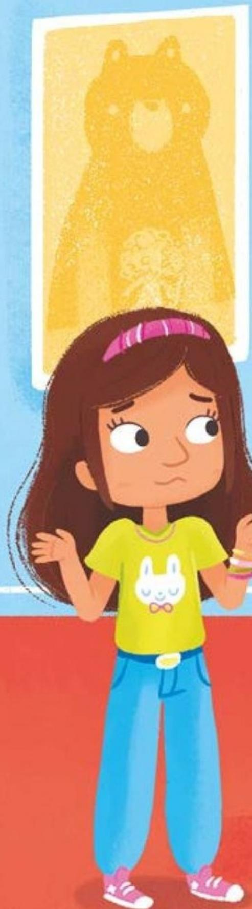

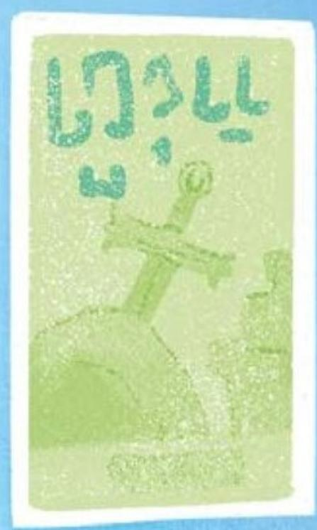

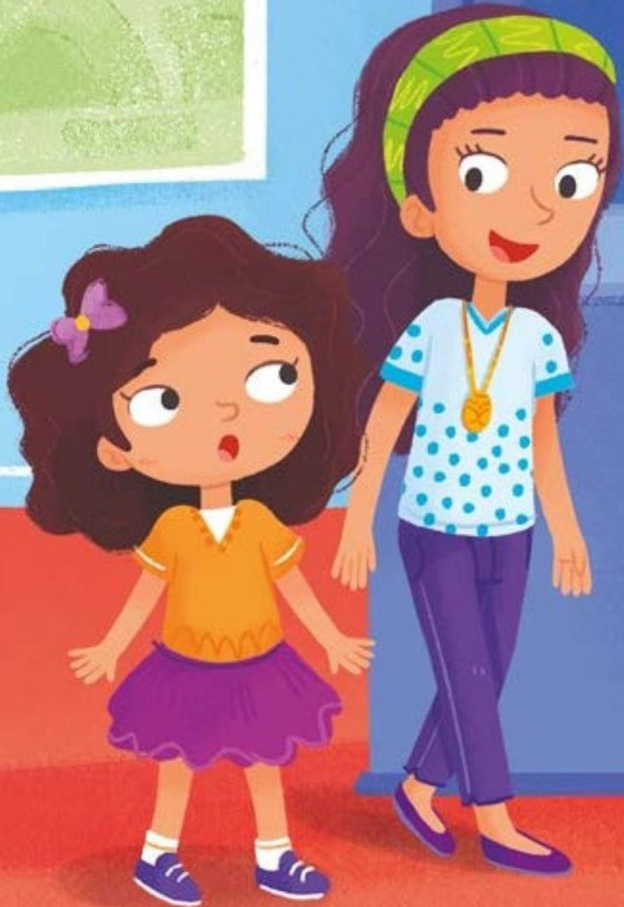

How should you behave at the movies? 

Should you cut in line or wait your turn to buy tickets? 

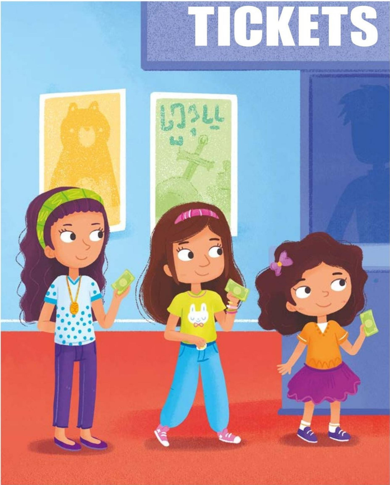

You should wait your turn to buy tickets. 

You should also have your money out and ready. 

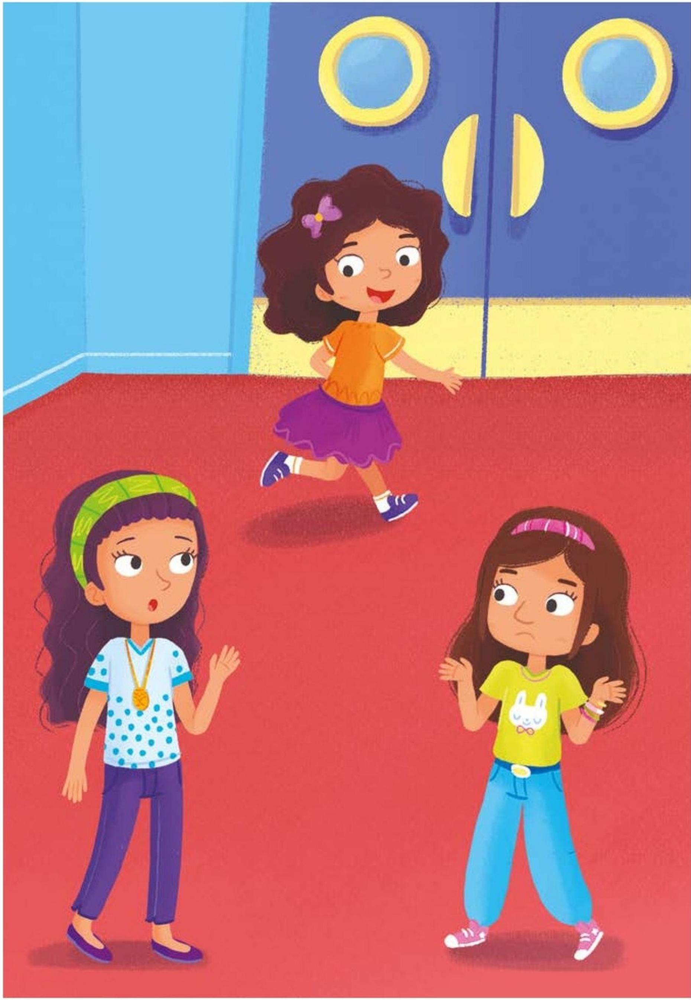

Should you run or walk to your seat in the theater? 

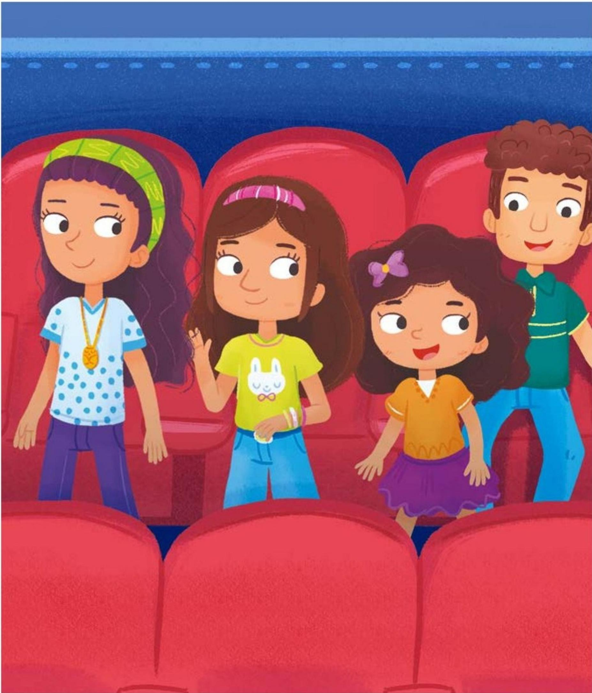

You should walk to your seat in the theater. 

You should also say, "Excuse me," when walking in front of someone. 

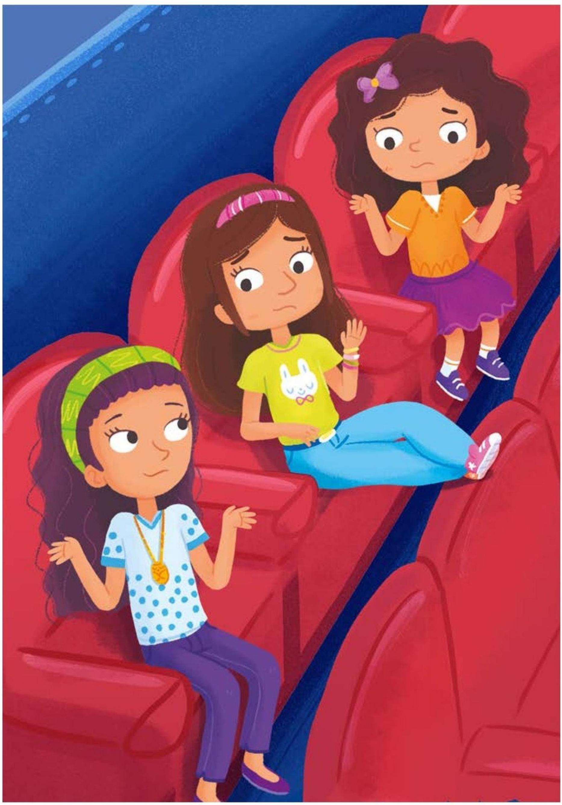

Should you put your feet up or down from the seat? 

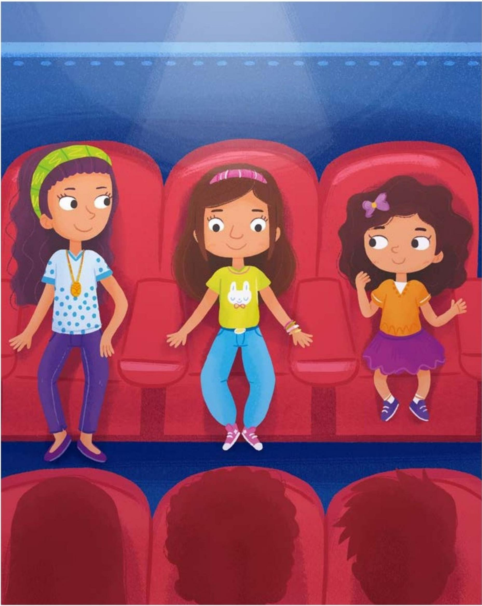

You should keep your feet down from the seat. 

You should also try to keep your feet and body still. 

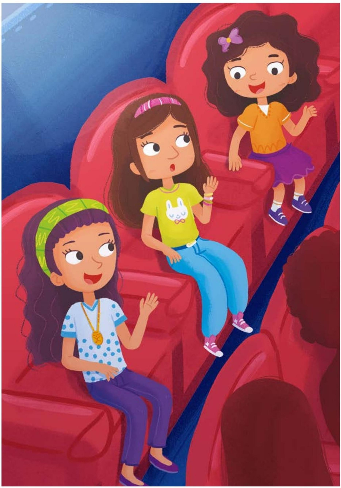

Should you talk or laugh during the movie? 

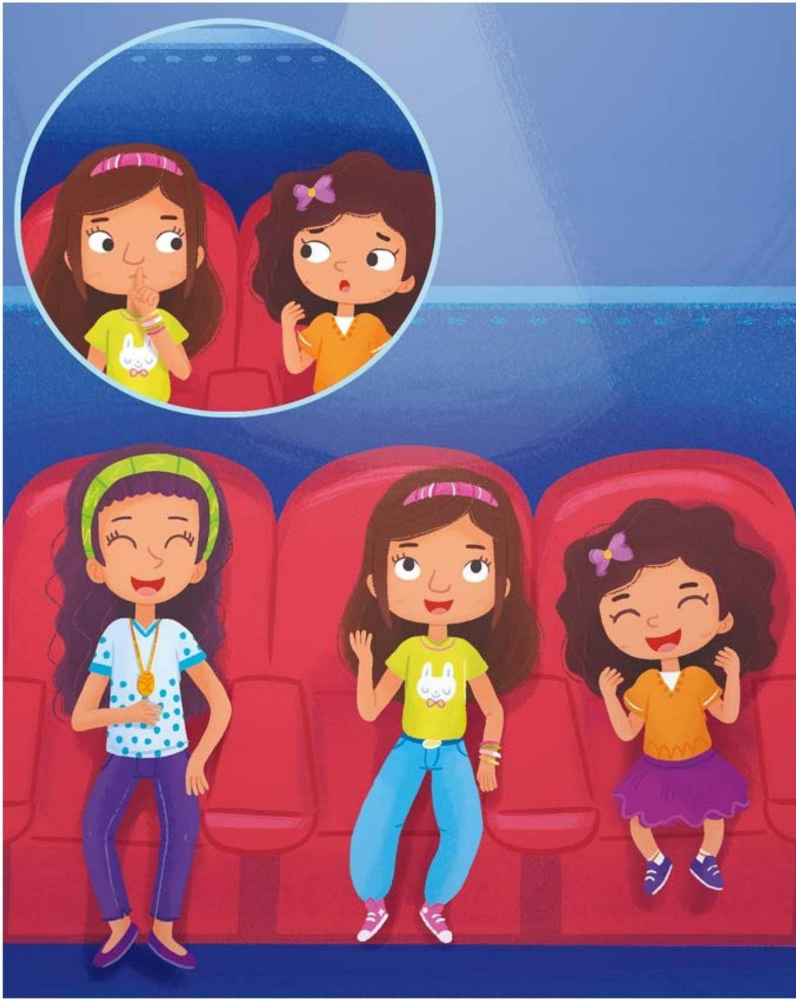

You shouldn't talk, so that others can hear the movie. 

You should laugh when the movie is funny! 

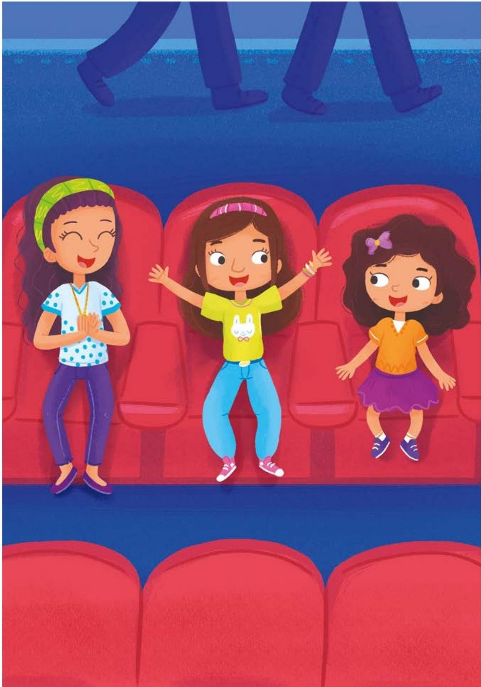

Should you clap or cheer at the end of the movie? 

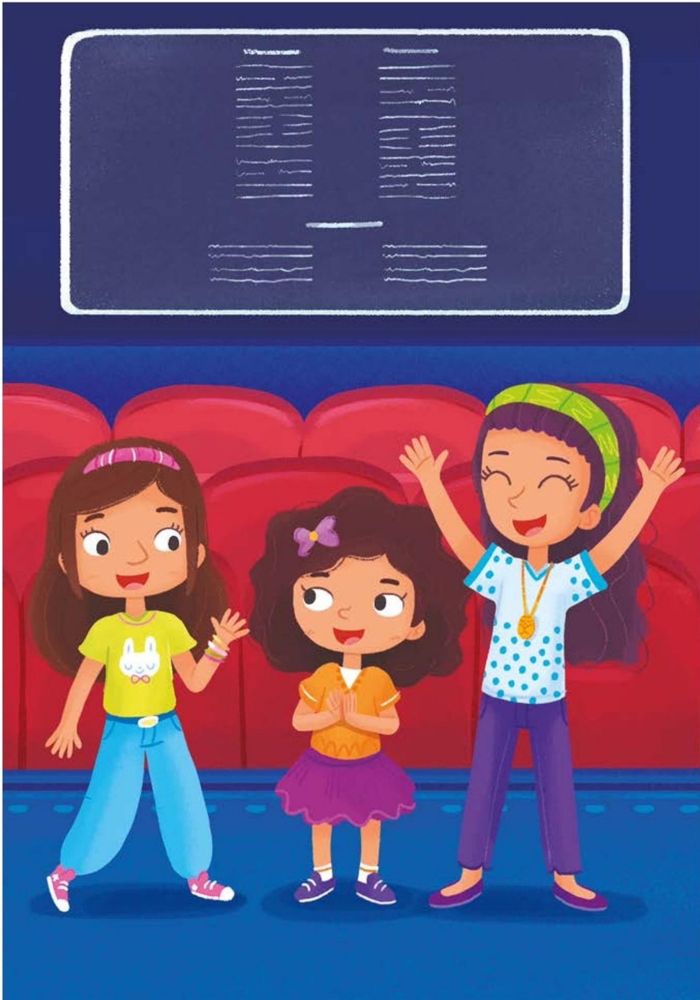

Yes, you should when the movie is good! 

# Connections

# Writing and Art

Create a poster for your class describing how to behave at the movies. Include pictures and words. 

# Math

Movie tickets cost nine dollars each. How much would three tickets cost? Solve the problem two ways. Share your work with a partner. 