# At the Watering Hole

Written by Rae Pilkington 

# At the Watering Hole

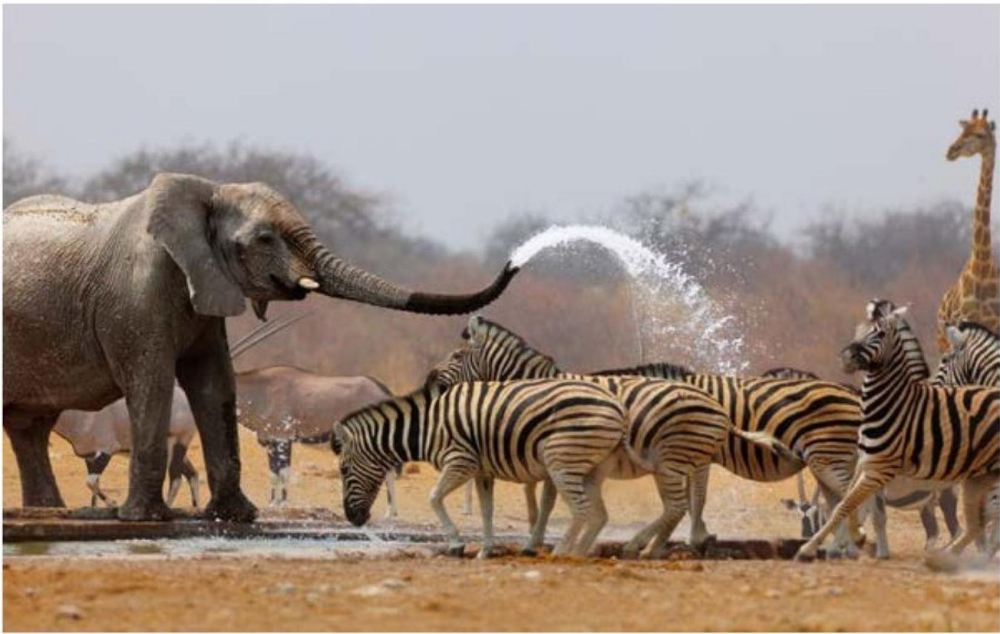

# Focus Question

What can you see at the watering hole? 

# Words to Know

drink 

flock 

pack 

parade 

savanna 

watering hole 

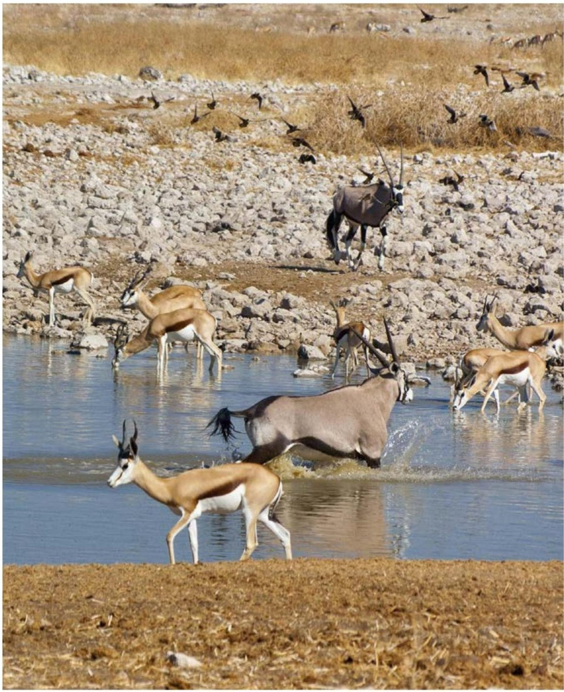

It is the dry season on the African savanna. Animals come to the watering hole to drink. 

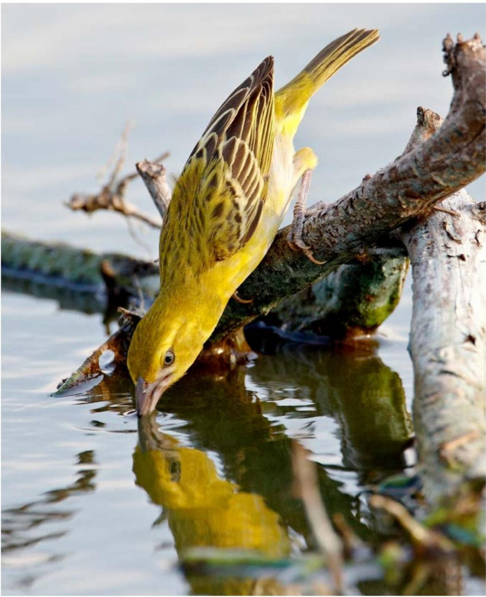

Some animals come alone to drink. 

A small bird bows to take a drink. 

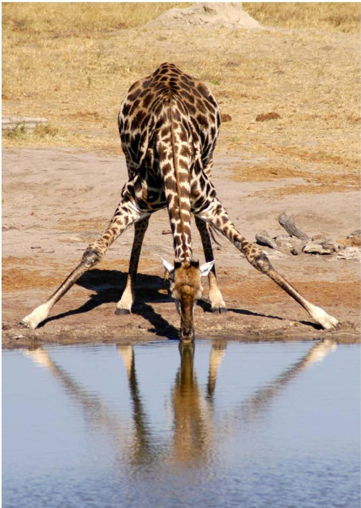

# A tall giraffe bends to take a drink.

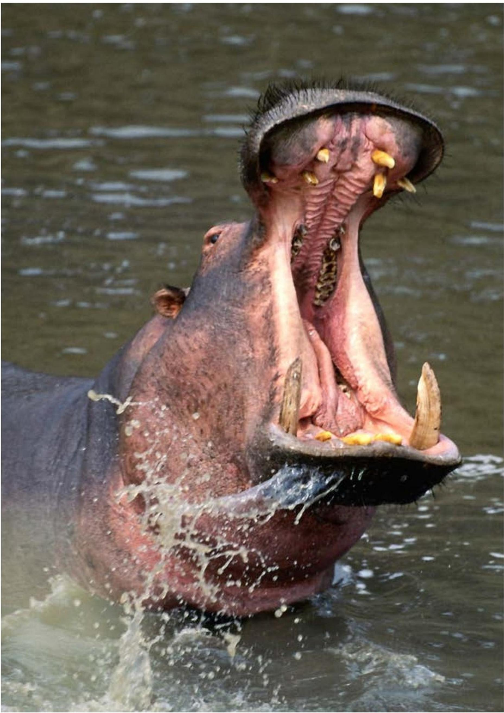

A big hippo dives to take a drink. 

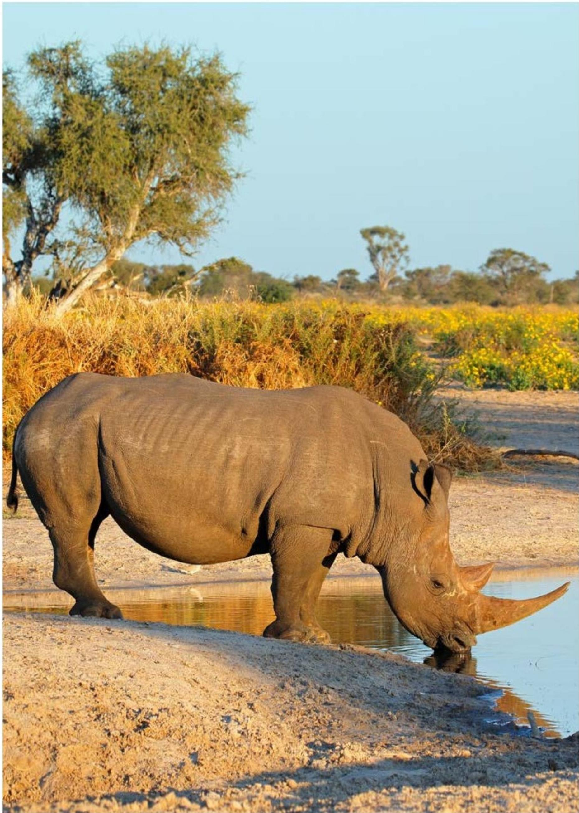

# A heavy rhino stops to take a drink.

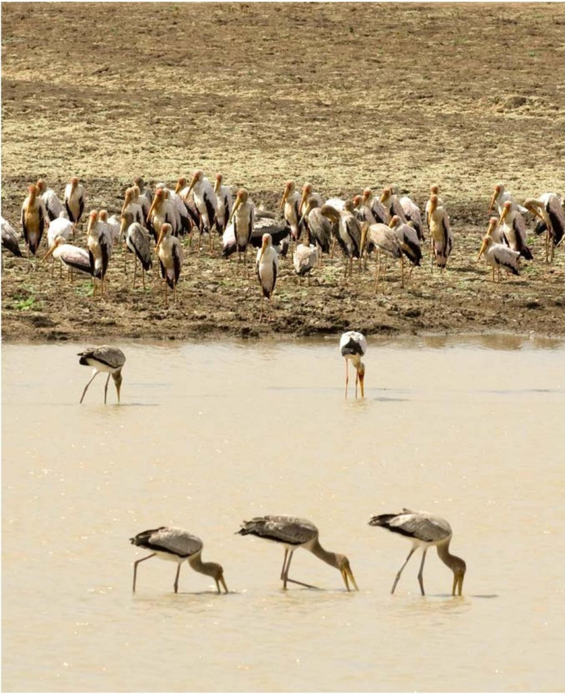

Some animals come together to drink. 

A flock of storks comes to take a drink. 

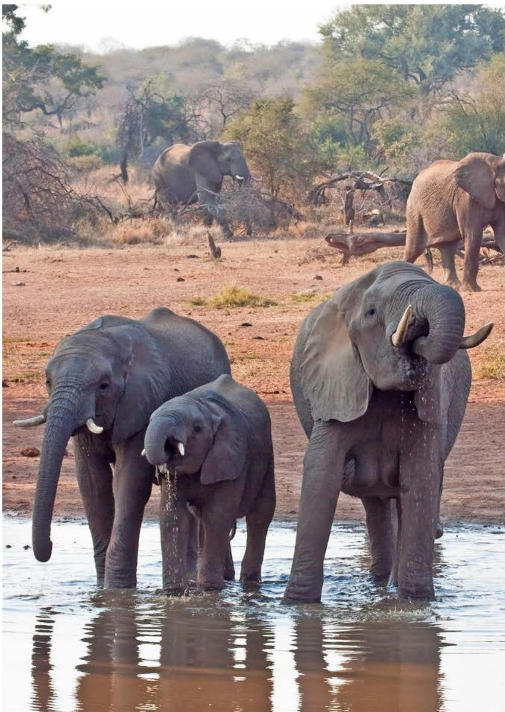

# A parade of elephants comes to take a drink.

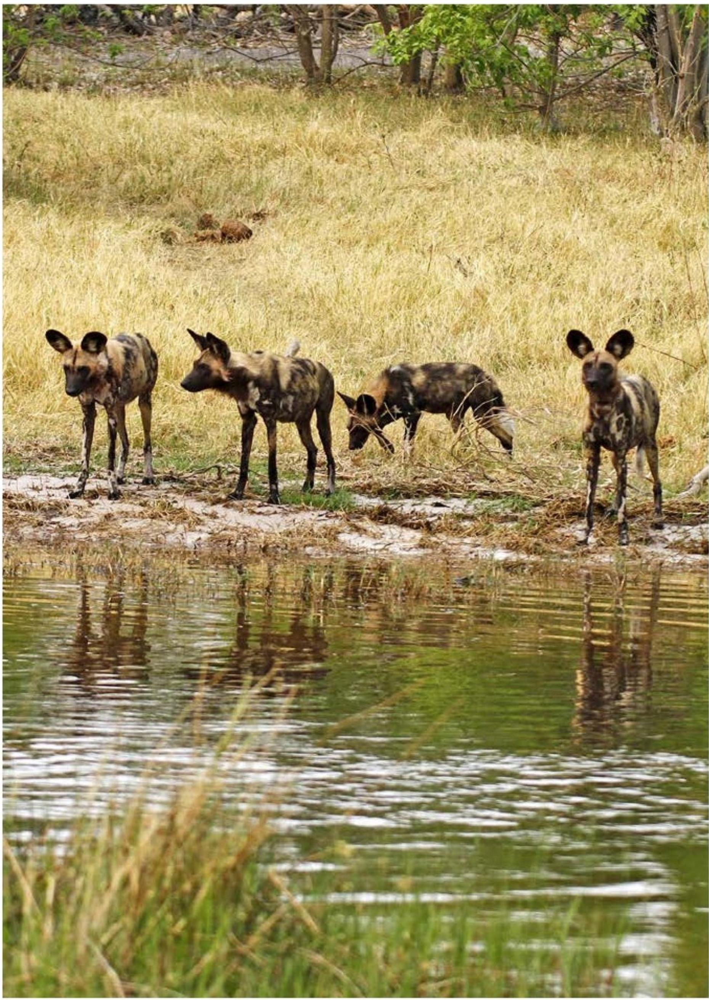

A pack of dogs comes to take a drink. 

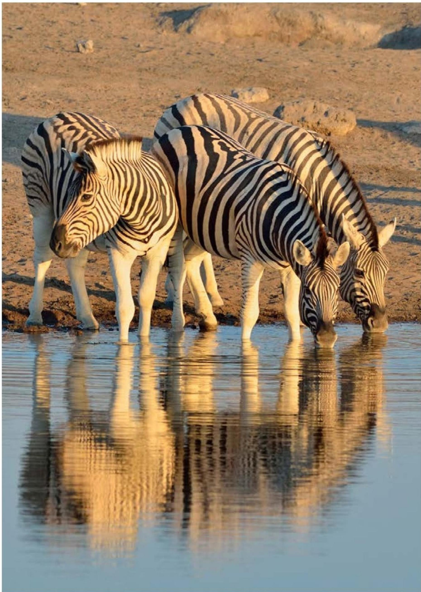

# A herd of zebras comes to take a drink.

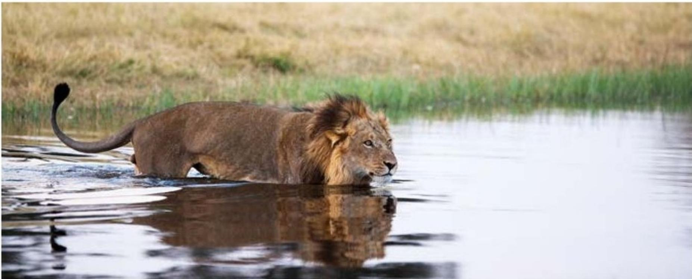

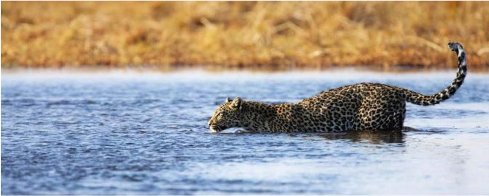

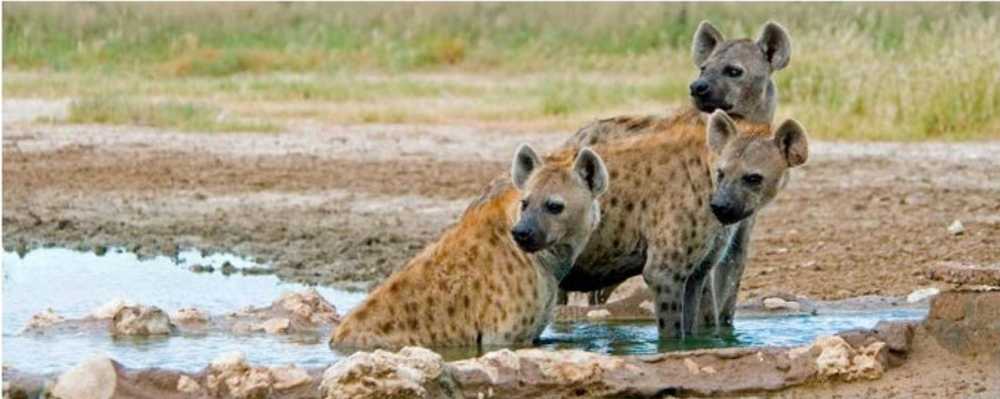

Some animals come to drink and hunt. 

Lions, leopards, and hyenas look for a meal. 

# Connections

# Writing

How can the African watering hole be both an important and dangerous place for animals? 

Write about it. 

# Social Studies

Find Africa on a world map or globe. Find the continent where you live. Share with a partner how the two continents are similar and different. 

# Reading A-Z

Visit www.readinga-z.com for thousands of books and materials. 