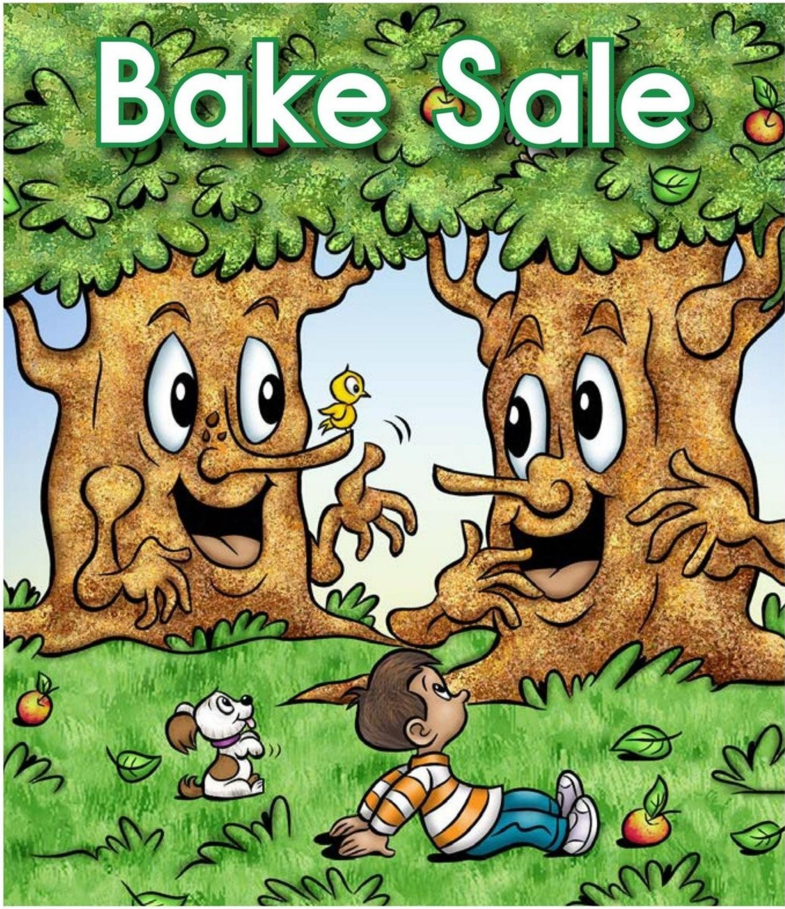

Written by Nora Voutas 

# Focus Question

What is Billy's problem, and how does he solve it? 

# Words to Know

bake sale 

tarts 

broken 

treats 

fixed 

upset 

Bake Sale 

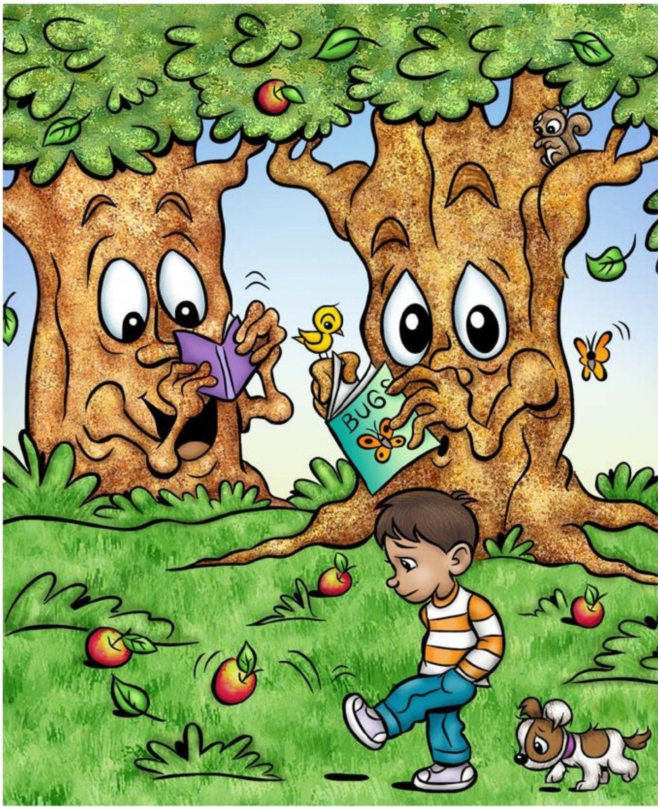

One day, Mac and Tosh were reading, and Billy came along. 

"Good Morning, Billy," Tosh said. 

"You look upset," Mac said. 

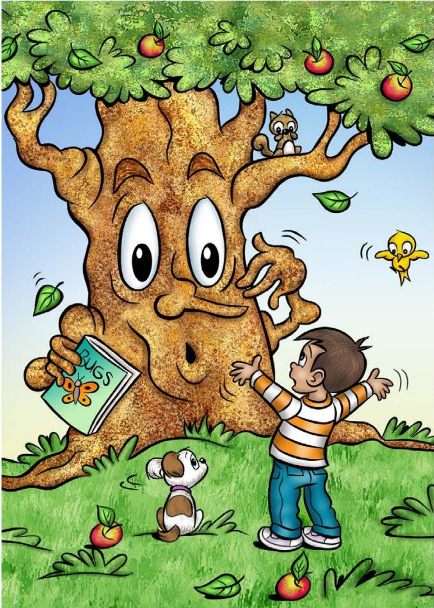

"My bike is broken!" Billy said. 

"Oh no!" Tosh replied. 

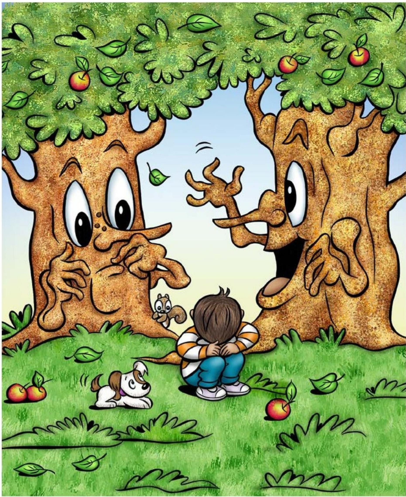

"I don't have enough money to get it fixed," Billy sighed. 

Tosh said, "Mac, we must help Billy fix his bike." 

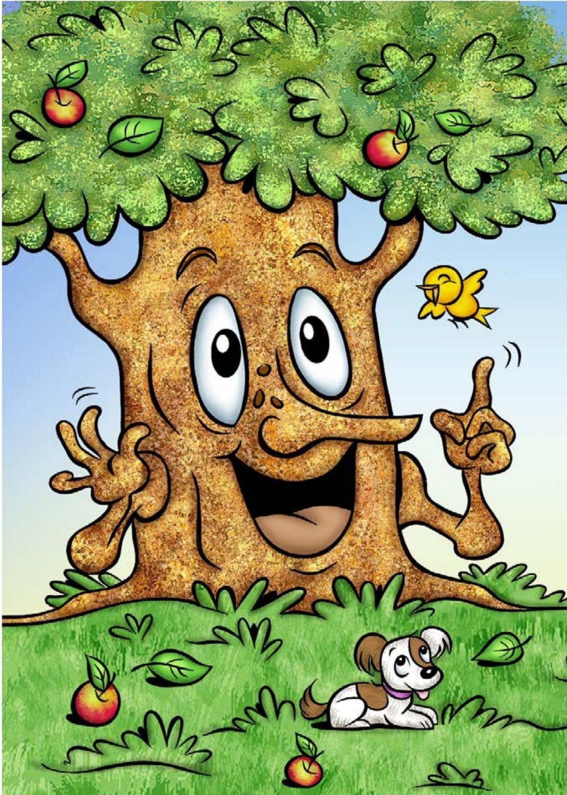

"Don't be upset, Billy, I have an idea," Mac said. 

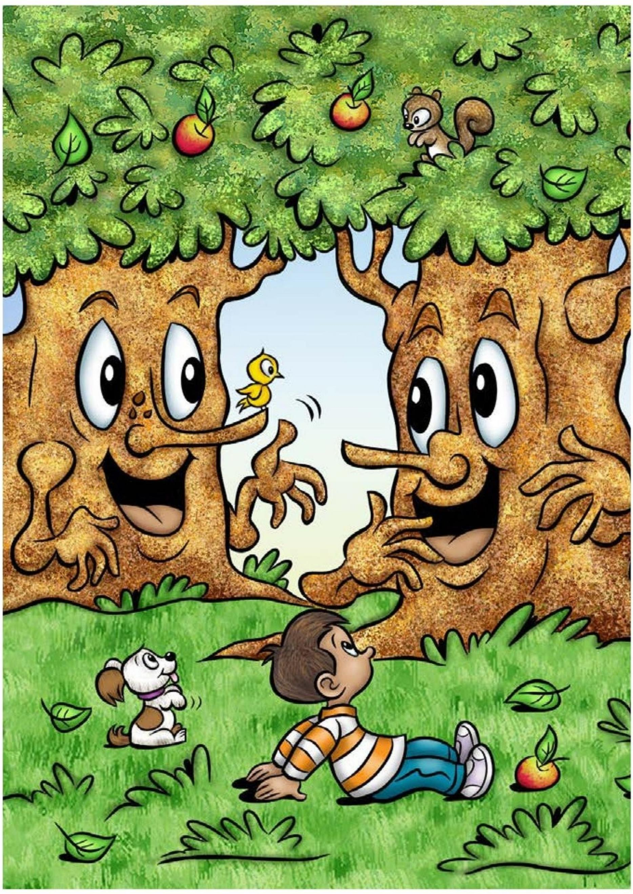

"We can have a bake sale," he added. 

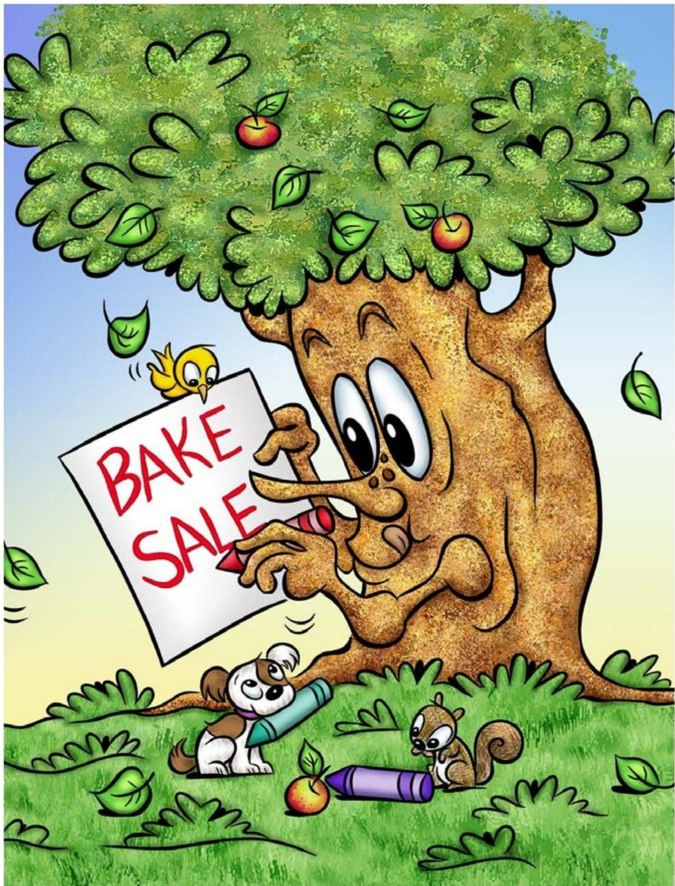

Mac started making signs. 

Mac put the signs up 

all over town. 

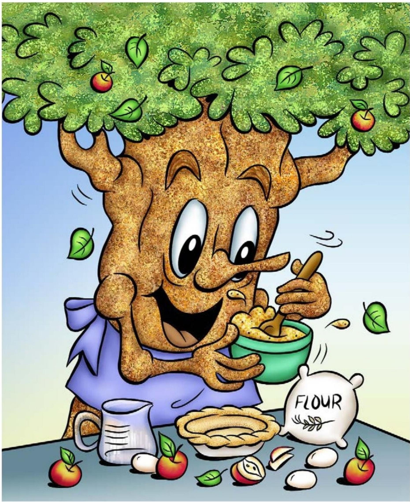

Tosh started picking apples and baking. 

Tosh baked many yummy apple treats. 

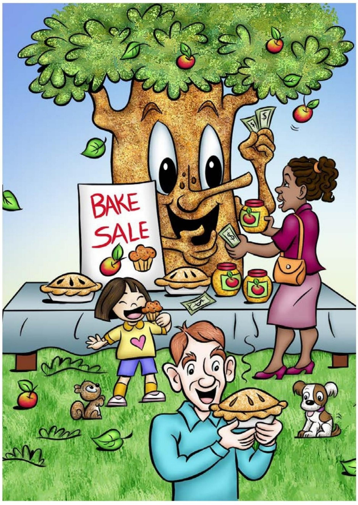

People bought apple pies. 

People bought applesauce. 

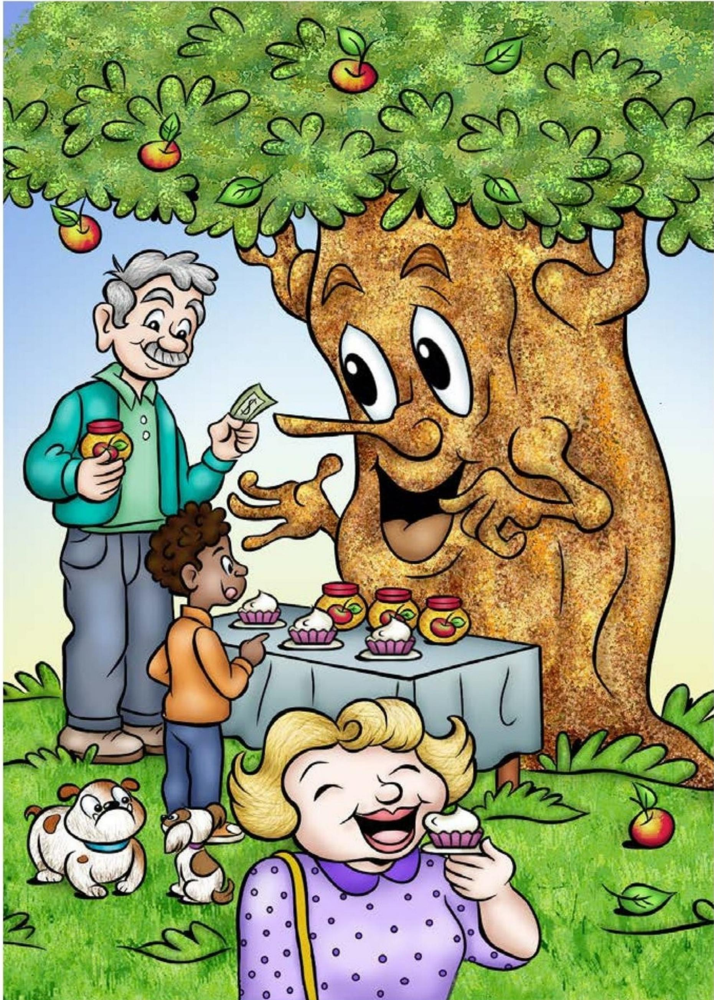

People bought apple jams. 

People bought apple tarts. 

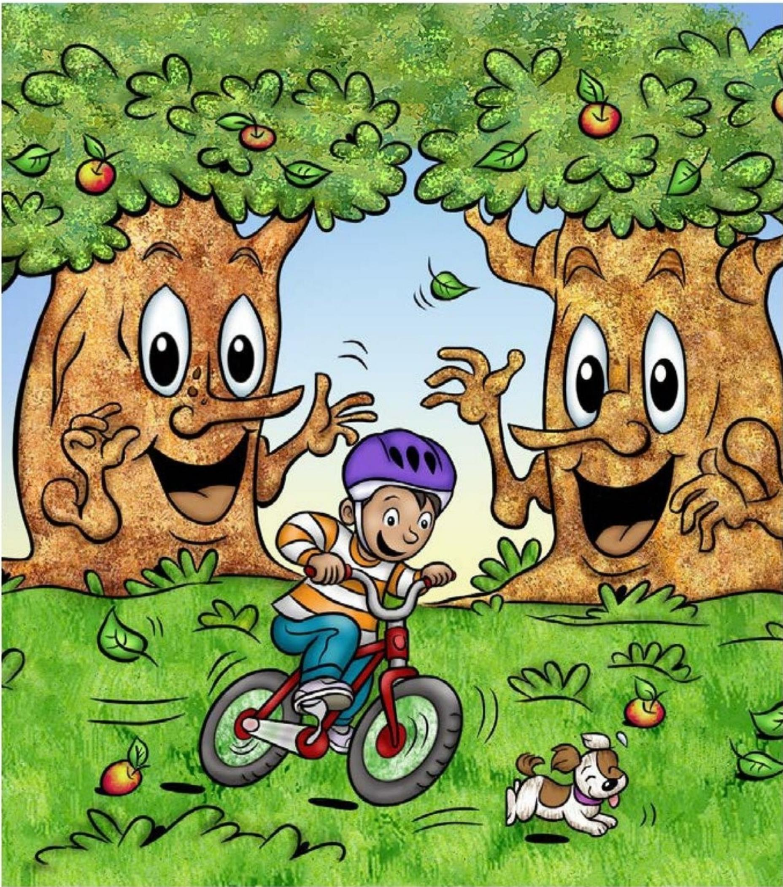

Soon, they had enough money for Billy to fix his bike. 

"Thanks, Mac and Tosh," Billy said. 

"Apples rule!" he added. 